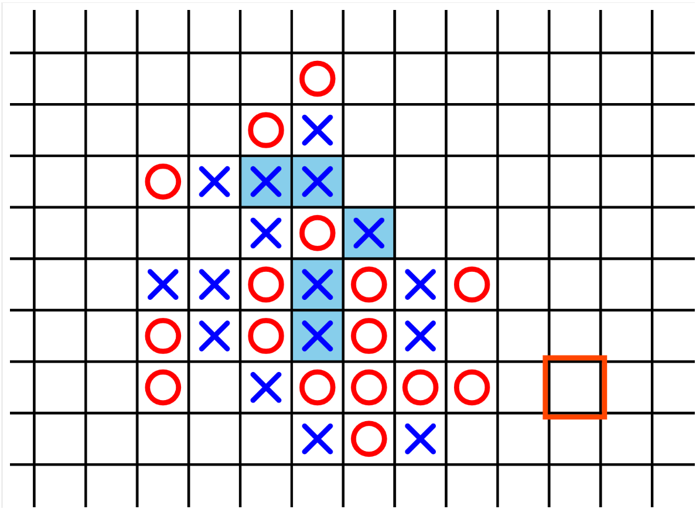

## hook-mark  
### ルール  
3目並べに似たルールです。〇または×を3つそろえるのではなく、フックの形に揃えたら勝ちです。  
フックの形は回転可能ですが、反転は不可です。  
### 操作方法  
・移動 / 矢印キー  
・プロット / スペースキー  
・拡大 / +キー  
・縮小 / -キー  
### プレイ  
[プレイ](https://hayabusa2-1998ky26.github.io/hook-mark/)  

